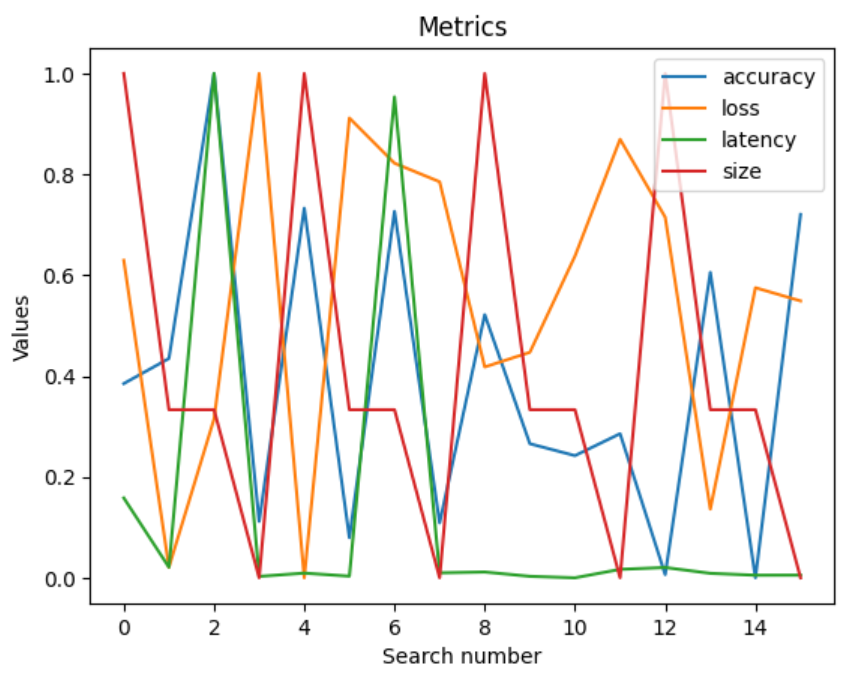
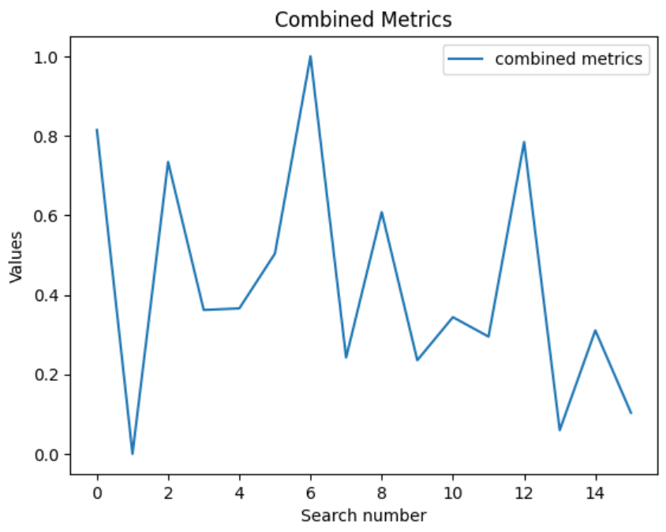

# Practical 2

## Lab 3

### 1. Explore additional metrics that can serve as quality metrics for the search process. For example, you can consider metrics such as latency, model size, or the number of FLOPs (floating-point operations) involved in the model.

While latency and model size (in memory) are good metrics, the number of parameters and the number of FLOPs are not relevant because such metrics don't change with quantization. We will thus focus only on latency and model size in memory.

### 2. Implement some of these additional metrics and attempt to combine them with the accuracy or loss quality metric. It's important to note that in this particular case, accuracy and loss actually serve as the same quality metric (do you know why?).

I used the `time` library to compute latency in my code :
```
# Measure Latency
with torch.no_grad():
    start_time = time.time()
    _ = mg.model(**dummy_in)
    end_time = time.time()
latency = end_time - start_time
```

Then I computed the memory size of the model, using the number of parameters and the size of each parameter (which differ according to quantization) :
```
num_params = sum(p.numel() for p in mg.model.parameters())
precision = config["linear"]["config"]["weight_width"]
size = num_params * precision
```

I then combined these metrics with accuracy and loss and tried to find the best trade-off. I normalized the data and then plotted the metrics for each search step :



This is hard to read so I built another metric, which is a combination of the others. We want to minimize loss, latency and size, whereas we want to maximize accuracy. However, accuracy and loss represent the same information here, so we can only focus on minimizing loss, latency and size. I thus built to combined metric of these 3 metrics and normalized it. Here is what I got :



We can see that for this particular network, the best quantization is the second one, which corresponds to :
```
data_in_width: 16
data_in_frac_width: 8
weight_width: 8
weight_frac_width: 6
bias_width: 8
bias_frac_width: 4
```

### 3. Implement the brute-force search as an additional search method within the system, this would be a new search strategy in MASE.

I tried to implement the new search startegy in `bruteforce.py`, but I didn't succeeded.
I thus used the optuna strategy, using the bruteforce sampler :
```
case "bruteforce":
    sampler = optuna.samplers.BruteForceSampler()
```

### 4. Compare the brute-force search with the TPE based search, in terms of sample efficiency. Comment on the performance difference between the two search methods.

The best metrics for bruteforce are :
`{'loss': 1.167, 'accuracy': 0.587}`

Whereas the best metrics for TPE are :
`{'loss': 1.483, 'accuracy': 0.539}`

The bruteforce method is giving a better network, which is awaited because it tries all possible networks.
However, the bruteforce method requires more computation power, that is used for computing some useless configurations.
Thus, a trade-off must be found between network optimization and computation power.
